# MyMovieGallery Database Architecture

## 1. Database Overview

MyMovieGallery is a premium AI-powered personal cinema platform. The database is designed for PostgreSQL 17 and SQLAlchemy 2.0 with async operations, strict normalization, soft-delete support, comprehensive auditing, recommendation data structures, and future-ready social features.

The database follows enterprise SaaS expectations:

- UUID primary keys across all user-owned and core entities
- 3NF-oriented schema design with explicit associative tables
- Soft delete via `deleted_at` on business entities
- Auditing via `created_at`, `updated_at`, `deleted_at`, `created_by`, `updated_by`
- partial and composite indexes optimized around movie search, recommendations, analytics, and watch behavior
- strict constraints for ratings, reviews, and unique user/movie records
- scalable analytics tables designed for aggregation and partitioning
- recommendation support for content-based, collaborative, and hybrid models

Core design goals:

- support millions of users and ratings without query bottlenecks
- robust movie catalog support with large metadata and media assets
- maintain search and recommendation performance at scale
- allow future social and collaborative features without schema churn
- preserve security and observability with audit and API logging

---

## 2. Database Design Decisions

### Why PostgreSQL 17

PostgreSQL 17 provides the strongest fit for this design because it combines:

- high concurrency for read-heavy dashboards
- JSONB for flexible recommendation metadata and settings
- strong indexing options: B-tree, GIN, GiST, BRIN, and trigram support
- partitioning support for large event tables
- MVCC to support high write/read workloads
- materialized and analytical query efficiency

### Why UUIDs

UUIDs provide safe distributed identity creation, easier merges, and safer external API consumption. For large-scale systems this prevents sequence scaling limits and reduces coupling to single-node identity generation.

### Why soft deletes

Soft delete allows data preservation for audit trails, import/export recovery, and user account restoration without immediate data loss. It also prevents referential breakage when removing user content while preserving historical analytics.

### Why explicit associative tables

The design separates relationship tables for: movie genres, cast, crew, favorites, collections, watchlists, recommendation history, user-role mapping, and more. This avoids bloating core tables and preserves efficient query patterns.

### Why normalized metadata tables

Movies contain many related entities: genres, images, countries, languages, crew, companies, release data, and certifications. Splitting those into separate tables allows efficient lookup, future extensibility, and performance when filtering by genre or country.

### Why analytics and recommendation tables are separated

Analytics and recommendation outputs are operationally different from source transaction tables. Keeping them separate improves query speed, supports historical snapshots, and enables partitioning and retention policies without affecting user behavior tables.

### Why audit and API logging are first-class tables

For SaaS-grade systems, observability is a core product requirement. `audit_logs` and `api_logs` create a compliance-friendly trail for user actions and external API events.

---

## 3. Entity Relationship Diagram

```mermaid
erDiagram
    USERS ||--o{ USER_ROLES : has
    ROLES ||--o{ USER_ROLES : grants
    USERS ||--o{ REFRESH_TOKENS : owns
    USERS ||--o{ OAUTH_ACCOUNTS : has
    USERS ||--o{ SESSIONS : maintains
    USERS ||--o{ DEVICES : registers
    USERS ||--o{ LOGIN_HISTORY : logs
    USERS ||--o{ RATINGS : creates
    USERS ||--o{ REVIEWS : writes
    USERS ||--o{ FAVORITES : saves
    USERS ||--o{ WATCH_HISTORY : records
    USERS ||--o{ WATCHLIST : owns
    USERS ||--o{ COLLECTIONS : owns
    USERS ||--o{ NOTIFICATIONS : receives
    USERS ||--o{ USER_PREFERENCES : stores
    USERS ||--o{ RECOMMENDATIONS : receives
    USERS ||--o{ SEARCH_HISTORY : searches
    USERS ||--o{ SAVED_SEARCHES : saves
    USERS ||--o{ API_LOGS : triggers
    USERS ||--o{ AUDIT_LOGS : acts_on

    MOVIES ||--o{ MOVIE_GENRES : includes
    MOVIES ||--o| MOVIE_METADATA : has
    MOVIES ||--o{ MOVIE_IMAGES : has
    MOVIES ||--o{ MOVIE_BACKDROPS : has
    MOVIES ||--o{ MOVIE_VIDEOS : has
    MOVIES ||--o{ MOVIE_TRAILERS : has
    MOVIES ||--o{ MOVIE_KEYWORDS : tagged
    MOVIES ||--o{ MOVIE_RELEASE_DATES : has
    MOVIES ||--o{ MOVIE_CAST : features
    MOVIES ||--o{ MOVIE_CREW : credits
    MOVIES ||--o{ RATINGS : receives
    MOVIES ||--o{ REVIEWS : receives
    MOVIES ||--o{ FAVORITES : offers
    MOVIES ||--o{ WATCH_HISTORY : appears_in
    MOVIES ||--o{ WATCHLIST_ITEMS : referenced
    MOVIES ||--o{ COLLECTION_MOVIES : appears_in
    MOVIES ||--o{ MOVIE_SIMILARITY : related_to
    MOVIES ||--o{ RECOMMENDATIONS : recommended

    ACTORS ||--o{ MOVIE_CAST : plays_in
    DIRECTORS ||--o{ MOVIE_CREW : directs
    WRITERS ||--o{ MOVIE_CREW : writes
    PRODUCERS ||--o{ MOVIE_CREW : produces

    REVIEWS ||--o{ REVIEW_LIKES : liked_by
    REVIEWS ||--o{ REVIEW_COMMENTS : comments
    WATCHLIST ||--o{ WATCHLIST_ITEMS : contains
    COLLECTIONS ||--o{ COLLECTION_MOVIES : includes
    RECOMMENDATIONS ||--o{ RECOMMENDATION_FEEDBACK : receives
    RECOMMENDATIONS ||--o{ RECOMMENDATION_HISTORY : tracked

    USERS ||--o{ USER_BADGES : earns
    BADGES ||--o{ USER_BADGES : awards
    USERS ||--o{ USER_ACHIEVEMENTS : unlocks
    ACHIEVEMENTS ||--o{ USER_ACHIEVEMENTS : grants
```



---

## 4. Complete Table List

### Authentication and authorization

- roles
- permissions
- user_roles
- refresh_tokens
- oauth_accounts
- email_verification_tokens
- password_reset_tokens
- sessions
- devices
- login_history

### Movies and metadata

- movies
- movie_metadata
- movie_images
- movie_backdrops
- movie_videos
- movie_trailers
- movie_keywords
- movie_genres
- movie_languages
- movie_countries
- movie_companies
- movie_collections
- movie_release_dates
- movie_certifications

### People

- actors
- directors
- writers
- producers
- movie_cast
- movie_crew

### User features

- ratings
- reviews
- review_likes
- review_comments
- favorites
- watch_history
- watchlist
- watchlist_items
- collections
- collection_movies
- user_preferences
- notifications
- notification_preferences

### AI and recommendation

- recommendations
- recommendation_history
- movie_similarity
- genre_similarity
- user_similarity
- recommendation_feedback

### Analytics

- daily_statistics
- monthly_statistics
- user_statistics
- genre_statistics
- watch_time_statistics
- activity_logs
- audit_logs

### Achievements

- badges
- user_badges
- achievements
- user_achievements

### Search

- search_history
- saved_searches

### Administration

- system_settings
- feature_flags
- api_logs

Total: 41 core tables with relationships and analytics tables included.

---

## 5. Table Definitions

### users

Purpose: authenticated user account and profile record.

Columns:
- id UUID PK
- email varchar(255) unique
- username varchar(80) unique
- full_name varchar(180)
- password_hash varchar(255)
- avatar_url varchar(512)
- is_active boolean
- is_verified boolean
- is_superuser boolean
- last_login_at timestamptz
- locale varchar(10)
- timezone varchar(80)
- marketing_opt_in boolean
- created_at timestamptz
- updated_at timestamptz
- deleted_at timestamptz
- created_by UUID FK users.id
- updated_by UUID FK users.id

### roles

Purpose: role definitions for access control.

### permissions

Purpose: fine-grained access operations.

### user_roles

Purpose: many-to-many mapping of users to roles.

### refresh_tokens

Purpose: rotation-based refresh tokens for JWT flows.

### oauth_accounts

Purpose: external login provider integration.

### email_verification_tokens

Purpose: email verification workflows.

### password_reset_tokens

Purpose: password reset completion tokens.

### sessions

Purpose: active authenticated sessions.

### devices

Purpose: device registration, push tokens, and session context.

### login_history

Purpose: login attempts, device fingerprints, and failure tracking.

### movies

Purpose: canonical movie master record.

Columns include:
- id, title, original_title, slug, overview, tagline
- release_date, runtime_minutes, status
- tmdb_id, imdb_id, popularity_score, vote_average, vote_count
- budget, revenue, is_adult, is_featured
- language_code, original_language
- created_at, updated_at, deleted_at, created_by, updated_by

### movie_metadata

Purpose: additional metadata and catalog detail.

### movie_images

Purpose: poster and image assets.

### movie_backdrops

Purpose: high-resolution backdrop media.

### movie_videos

Purpose: provider videos and embedded metadata.

### movie_trailers

Purpose: trailer-specific URLs and source metadata.

### movie_keywords

Purpose: tags or keywords associated with a movie.

### movie_genres

Purpose: many-to-many mapping of movies to genre strings or dimension table values.

### movie_languages

Purpose: reference table of spoken languages.

### movie_countries

Purpose: countries of production and release metadata.

### movie_companies

Purpose: production, distribution, and studio metadata.

### movie_collections

Purpose: franchise collections or multi-film bundles.

### movie_release_dates

Purpose: region-specific release dates and certifications.

### movie_certifications

Purpose: film rating classification metadata by country.

### actors

Purpose: cast person catalog.

### directors

Purpose: director catalog.

### writers

Purpose: writer catalog.

### producers

Purpose: producer catalog.

### movie_cast

Purpose: cast assignments for movies.

### movie_crew

Purpose: crew assignments, including department, job, and person IDs.

### ratings

Purpose: one rating per user per movie.

Key rules:
- score must be between 1 and 10
- unique user_id + movie_id

### reviews

Purpose: long-form user review entries.

Constraints:
- one review per user per movie
- soft-delete support with `deleted_at`

### review_likes

Purpose: likes for a review.

### review_comments

Purpose: threaded review conversation.

### favorites

Purpose: saved movie favorites.

### watch_history

Purpose: timestamped movie watch events.

### watchlist

Purpose: user watchlist collection container.

### watchlist_items

Purpose: movies within a watchlist in priority order.

### collections

Purpose: curated user-created collections.

### collection_movies

Purpose: movies inside user collections.

### user_preferences

Purpose: user personalization settings and serialized preference values.

### notifications

Purpose: user notifications and payloads.

### notification_preferences

Purpose: toggle-based notification channels.

### recommendations

Purpose: result set for AI recommendation outputs.

### recommendation_history

Purpose: track recommendation actions and user behavior.

### movie_similarity

Purpose: item-to-item similarity matrix for content similarity.

### genre_similarity

Purpose: genre-to-genre similarity used for hybrid recommendations.

### user_similarity

Purpose: user-user collaborative similarity matrix.

### recommendation_feedback

Purpose: explicit user feedback to improve future ranking.

### daily_statistics

Purpose: daily aggregate snapshots.

### monthly_statistics

Purpose: monthly aggregate snapshots.

### user_statistics

Purpose: user-level analytics such as streak and watch totals.

### genre_statistics

Purpose: genre-specific aggregate trends.

### watch_time_statistics

Purpose: daily or user watch duration summaries.

### activity_logs

Purpose: application-level user event logs.

### audit_logs

Purpose: security and data-change history.

### badges

Purpose: badge definitions.

### user_badges

Purpose: user-to-badge awards.

### achievements

Purpose: achievement definitions.

### user_achievements

Purpose: unlocked achievements and progress.

### search_history

Purpose: user and anonymous search queries.

### saved_searches

Purpose: reusable saved filters and query presets.

### system_settings

Purpose: configuration values for platform operation.

### feature_flags

Purpose: feature rollouts and controlled launch toggles.

### api_logs

Purpose: request observability and operational diagnostics.

---

## 6. Relationships

### One-to-One

- `users` to `user_statistics` via `user_id` (one user, one statistic record)
- `movies` to `movie_metadata` via `movie_id`
- `users` to `notification_preferences` by user (one preference set per user, typically many category entries if not normalized further)

### One-to-Many

- `users` to `ratings`
- `users` to `reviews`
- `users` to `watch_history`
- `users` to `watchlist`
- `users` to `notifications`
- `movies` to `movie_images`
- `movies` to `movie_backdrops`
- `movies` to `reviews`
- `movies` to `watch_history`
- `movie_collections` to `collection_movies`
- `watchlist` to `watchlist_items`

### Many-to-Many

- `users` <-> `roles` via `user_roles`
- `movies` <-> `genres` via `movie_genres`
- `movies` <-> `actors` via `movie_cast`
- `movies` <-> `directors` via `movie_crew`
- `movies` <-> `writers` via `movie_crew`
- `movies` <-> `producers` via `movie_crew`
- `users` <-> `movies` favorites via `favorites`
- `users` <-> `movies` in recommendations via `recommendations`
- `users` <-> `badges` via `user_badges`
- `users` <-> `achievements` via `user_achievements`

---

## 7. Constraints

Key constraints include:

- `reviews.user_id + movie_id` unique
- `ratings.user_id + movie_id` unique
- `score >= 1 AND score <= 10`
- `movie_release_dates(movie_id, region, release_date)` unique
- `watchlist_items(watchlist_id, movie_id)` unique
- `collection_movies(collection_id, movie_id)` unique
- `review_likes(review_id, user_id)` unique
- `user_roles(user_id, role_id)` unique
- `oauth_accounts(provider, provider_user_id)` unique
- `search_history` and `activity_logs` maintain non-null query/action requirements

---

## 8. Indexes

Recommended index strategy:

### Movie search
- GIN index on `movies.title` with trigram support
- GIN index on `tsvector` search column
- composite index on `(release_date DESC, vote_average DESC)`
- index on `slug`

### Recommendations
- `(user_id, created_at DESC)` on `recommendations`
- `(movie_id, score DESC)` on `movie_similarity`
- `(user_id, similar_user_id)` on `user_similarity`

### Analytics
- `(stat_date DESC)` for daily statistics
- `(year, month)` for monthly statistics
- `(user_id, stat_date)` for watch_time_statistics

### Watch history
- `(user_id, watched_at DESC)`
- `(movie_id, watched_at DESC)`

### Reviews
- `(movie_id, created_at DESC)`
- `(user_id, created_at DESC)`

### Ratings
- `(movie_id, score DESC)`
- `(user_id, movie_id)` unique

### Trending movies
- `(is_featured, vote_average DESC, vote_count DESC)`
- `(release_date DESC, popularity_score DESC)`

### Dashboard
- `(user_id, created_at DESC)` for notifications and activity
- `(user_id, updated_at DESC)` for user statistics and preferences

---

## 9. SQLAlchemy Models

The SQLAlchemy models are implemented in [backend/app/models.py](../app/models.py) and follow SQLAlchemy 2.0 declarative patterns with `Mapped[]`, `relationship()`, `back_populates`, indexes, and UUID primary keys.

Core design patterns:

- `Base` from declarative base
- `AuditMixin` used for standard auditing fields
- `UUID` columns for all primary keys
- `Enum` values are represented via string-backed Python enums where appropriate
- `JSONB` for flexible payloads and preferences
- explicit `UniqueConstraint` and `CheckConstraint` definitions

Example pattern:

```python
class Rating(Base):
    __tablename__ = "ratings"

    id: Mapped[uuid.UUID] = mapped_column(UUID(as_uuid=True), primary_key=True, default=uuid.uuid4)
    user_id: Mapped[uuid.UUID] = mapped_column(UUID(as_uuid=True), ForeignKey("users.id"), nullable=False)
    movie_id: Mapped[uuid.UUID] = mapped_column(UUID(as_uuid=True), ForeignKey("movies.id"), nullable=False)
    score: Mapped[int] = mapped_column(Integer(), nullable=False)
    created_at: Mapped[datetime] = mapped_column(DateTime(timezone=True), server_default=func.now(), nullable=False)

    __table_args__ = (
        CheckConstraint("score >= 1 AND score <= 10", name="ck_ratings_score_range"),
        UniqueConstraint("user_id", "movie_id", name="uq_ratings_user_movie"),
    )
```

---

## 10. Alembic Migration Plan

The initial migration scaffold and Alembic environment are present in:

- [backend/alembic.ini](../alembic.ini)
- [backend/alembic/env.py](../alembic/env.py)
- [backend/alembic/script.py.mako](../alembic/script.py.mako)
- [backend/alembic/versions/20260905_initial_schema.py](../alembic/versions/20260905_initial_schema.py)

Migration strategy:

1. Create baseline schema with core auth, movies, and user tables.
2. Add analytics and recommendation tables in a second migration.
3. Add full-text search columns and GIN indexes in a dedicated migration.
4. Add partitions for heavy event tables using PostgreSQL partitioning.
5. Add triggers or generated columns needed for analytics snapshots.

---

## 11. Seed Data

Seed data is implemented in [backend/app/seed_data.py](../app/seed_data.py) and includes:

- genres
- languages
- countries
- movie certifications
- roles
- permissions
- system settings
- feature flags
- badge definitions

The seed system is idempotent: it avoids duplicates by checking for existing records before inserting.

---

## 12. Performance Optimizations

### Pagination and cursor pagination

Use keyset pagination in heavy endpoints:

- `created_at`, `id` as cursor for activity and reviews
- `watched_at`, `id` for watch history
- `created_at`, `id` for notifications
- `popularity_score`, `id` for trending lists

### Sorting and filtering

Filter combinations are better served with composite indexes that match common access patterns:

- `movie_id + created_at` for review timeline
- `movie_id + score` for rating rankings
- `user_id + watched_at` for watch history
- `release_date + vote_average` for trending lists

### Recommendation queries

Recommendation queries should be staged in precomputed or materialized tables and re-run by asynchronous background workers. This prevents the recommendation compute from blocking user reads.

### Dashboard loading

Dashboard endpoints should aggregate from precomputed daily summary tables rather than scanning large fact tables for every request.

---

## 13. Partitioning Strategy

### Watch history

Partition by month or year using `watched_at`.

Example:

- `watch_history_2026_09`
- `watch_history_2026_10`

This yields efficient retention and clean archival strategies.

### Audit logs

Partition by month or quarter.

### API logs

Partition by month, with TTL policies and hot/warm archiving.

### Activity logs

Partition by month with optional user-specific retention windows.

### Analytics

Partition daily or monthly metric fact tables by date range. This supports large scale rollup and simplified retention management.

---

## 14. Redis Cache Strategy

Recommended cache targets:

- movie detail pages
- top trending lists
- user recommendations
- dashboard stats
- search result summaries
- genre and certification metadata

Suggested TTLs:

- movie metadata: 6 hours
- recommendation output: 1 hour
- trending lists: 15 minutes
- analytics snapshots: 30 minutes
- session token storage: short-lived, 15-30 minutes

Cache key format:

- `movie:detail:{movie_id}`
- `movie:trending:{page}:{sort}:{filter_hash}`
- `user:recommendations:{user_id}:{model_version}:{page}`
- `dashboard:stats:{user_id}:{date}`

Invalidation strategy:

- invalidate on rating/review/favorite changes
- invalidate on watch history update
- invalidate recommendation cache when a user interacts with new media
- invalidate movie metadata cache on edits or imports

---

## 15. Full Text Search Design

PostgreSQL full-text search should be implemented with:

- `TSVECTOR` column for movie title, overview, genres, and keywords
- `GIN` indexes on the `tsvector`
- trigram indexes for fuzzy matching and typo tolerance
- `ts_rank_cd` for ranking relevant results
- prefix/autocomplete support via `LOWER(title)` and trigram GIN indexes

Example:

```sql
ALTER TABLE movies ADD COLUMN search_vector tsvector GENERATED ALWAYS AS (
    to_tsvector('english', coalesce(title, '') || ' ' || coalesce(overview, ''))
) STORED;

CREATE INDEX idx_movies_search_vector ON movies USING GIN (search_vector);
CREATE INDEX idx_movies_title_trgm ON movies USING GIN (title gin_trgm_ops);
```

This supports:

- natural language search
- fuzzy matching with typo tolerance
- autocomplete queries
- weighted ranking for names, titles, and tags

---

## 16. Security Best Practices

### Database roles

Use at least three roles:

- app_role: read/write access to application tables
- readonly_role: reporting and analytics access
- migration_role: schema creation and migration privileges

### Least privilege

- application only gets specific access to required schemas
- no default superuser access for app services
- secrets stored via environment variables or secret manager

### Encryption

- encrypt credentials at rest and in transit
- use TLS for all database connections
- store sensitive values in secret manager

### Audit logging

- log privileged changes in `audit_logs`
- record user identity, old and new values, and timestamps
- monitor suspicious login attempts in `login_history`

---

## 17. Scaling Strategy

### Read scalability

- use read replicas for analytics and reporting data
- cache lists and aggregated dashboard stats in Redis
- precompute recommendation outputs asynchronously

### Write scalability

- keep API write paths minimal and transaction-focused
- move heavy analytics rollups to background jobs
- use append-heavy tables for logs and events

### Future social features

The schema already anticipates:

- friendship and followers
- shared collections
- movie clubs
- collaborative watchlists
- real-time notifications
- AI assistants and multiple recommendation engines

This is supported by the normalized architecture and extensible associative model.

---

## 18. Final Folder Structure

```text
backend/
├── alembic/
│   ├── versions/
│   │   └── 20260905_initial_schema.py
│   ├── env.py
│   ├── script.py.mako
│   └── README.md
├── app/
│   ├── db/
│   │   ├── __init__.py
│   │   ├── base.py
│   │   └── session.py
│   ├── api/
│   │   ├── deps.py
│   │   └── routes/
│   ├── core/
│   │   ├── config.py
│   │   ├── security.py
│   │   └── logging.py
│   ├── models.py
│   ├── seed_data.py
│   ├── schemas/
│   │   ├── auth.py
│   │   ├── movie.py
│   │   └── user.py
│   ├── services/
│   │   ├── auth_service.py
│   │   ├── movie_service.py
│   │   ├── recommendation_service.py
│   │   └── analytics_service.py
│   ├── repositories/
│   │   ├── movie_repo.py
│   │   ├── user_repo.py
│   │   └── analytics_repo.py
│   ├── utils/
│   │   ├── pagination.py
│   │   ├── search.py
│   │   └── export.py
│   └── __init__.py
├── docs/
│   └── database_design.md
├── tests/
│   ├── integration/
│   ├── unit/
│   └── fixtures/
├── .env.example
├── alembic.ini
├── pyproject.toml
├── requirements.txt
└── README.md
```

---

## Summary

This architecture gives MyMovieGallery a production-grade PostgreSQL foundation that supports:

- millions of users and records
- normalized metadata and asset management
- scalable recommendation engine data
- analytics and auditing
- future social expansion
- secure auth and access control
- efficient full-text search and performance tuning

It is intentionally designed as an enterprise SaaS schema, not a toy application schema.
